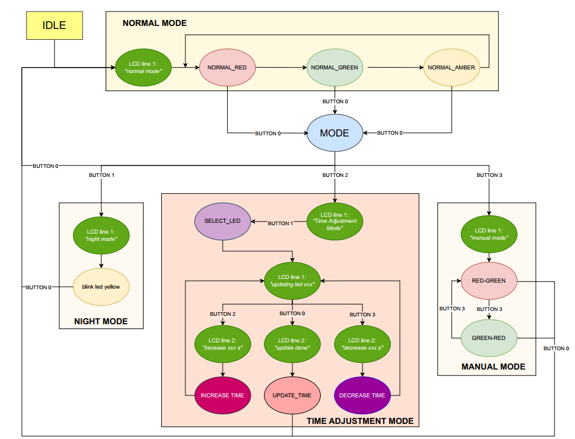

# Multi-Mode Traffic Light System

## Thành viên nhóm

| NAME             |
| ---------------- |
| DƯƠNG MINH HIẾU  |
| TRỊNH THỊ MỸ LỆ   |
| NGUYỄN NGỌC HÀ MY |

## Vai trò

Trong dự án này, tôi đảm nhận vai trò:

* Phát triển chế độ ban đêm cho hệ thống đèn giao thông.
* Thiết kế và hiện thực giao diện web với ESP32, cho phép người dùng điều khiển hệ thống đèn giao thông qua trình duyệt web, thay thế cho các nút bấm vật lý truyền thống.

## Mô tả đề tài

Dự án “Multi-Mode Traffic Light System” sử dụng vi điều khiển STM32 và ESP32 được xây dựng nhằm cung cấp một giải pháp điều tiết giao thông linh hoạt và hiệu quả, có khả năng thích ứng với nhiều tình huống giao thông khác nhau. Hệ thống được thiết kế với bốn chế độ hoạt động chính:

* **Chế độ chọn Mode:** Cho phép người dùng lựa chọn giữa các chế độ hoạt động khác nhau của hệ thống.
* **Chế độ bình thường (Normal Mode):** Đèn giao thông hoạt động theo thời gian được thiết lập sẵn cho mỗi tín hiệu đèn (xanh, vàng, đỏ).
* **Chế độ ban đêm (Night Mode):** Hệ thống chuyển sang chế độ cảnh báo, trong đó đèn vàng sẽ nhấp nháy liên tục với chu kỳ 1 giây để nhắc nhở người tham gia giao thông.
* **Chế độ điều chỉnh thời gian (Time Adjustment Mode):** Cung cấp khả năng điều chỉnh tăng giảm thời gian hiển thị của mỗi tín hiệu đèn, cho phép tùy biến chu kỳ hoạt động của đèn giao thông.
* **Chế độ thủ công (Manual Mode):** Người dùng có thể trực tiếp điều khiển trạng thái bật/tắt của đèn xanh và đèn đỏ cho từng hướng hoặc luồng giao thông, phù hợp cho các tình huống đặc biệt như điều tiết giao thông khi có sự cố.

## Phần cứng sử dụng

* **Vi điều khiển:**
    * **STM32:** Đảm nhiệm vai trò xử lý trung tâm, thực hiện các thuật toán điều khiển đèn giao thông ở các chế độ khác nhau (Bình thường, Ban đêm, Điều chỉnh thời gian, Thủ công).
    * **ESP32:** Được sử dụng để thiết lập kết nối Wi-Fi và xây dựng giao diện web cho phép người dùng chọn chế độ hoạt động của hệ thống qua web mà không cần đến thiết bị ngoại vi.
* **Linh kiện ngoại vi:** button, led, dây tín hiệu, LCD.

## Mô tả flow hoạt động

Hệ thống cung cấp 4 chế độ hoạt động chính: **Bình Thường**, **Ban Đêm**, **Chỉnh Thời Gian**, **Thủ Công** và **MODE**. Mỗi chế độ mang lại các chức năng điều khiển cụ thể để quản lý giao thông trong nhiều hoàn cảnh khác nhau.

Sau khi nhấn **Button0**, hệ thống sẽ vào chế độ chọn **MODE** và sau đó bấm các button sau:

* **Button0: Chế độ Bình Thường (Normal Mode):**
    * Trong chế độ này, đèn giao thông hoạt động theo chu kỳ tự động chuẩn gồm ba pha: Xanh - Vàng - Đỏ. Đây là chế độ mặc định, và hệ thống sẽ quay lại chế độ này nếu không có sự can thiệp thêm.
    * Mặc định ban đầu, đèn đỏ sáng 8 giây, đèn vàng sáng 3 giây, đèn xanh sáng 5 giây.
    * Hiện LCD dòng 1: `normal mode`
* **Button1: Chế độ Ban Đêm (Night Mode):**
    * Khi chọn chế độ Ban Đêm, đèn giao thông được tối ưu hóa để tiết kiệm năng lượng và tăng cường cảnh báo cho phương tiện. Chế độ này là tắt hết đèn đỏ và xanh, chỉ chỉnh cho đèn Vàng nhấp nháy liên tục mỗi 1 giây.
    * Hiện LCD dòng 1: `night mode`
    * Nếu ấn Button0, lập tức về trạng thái ban đầu.
* **Button2: Chế độ Chỉnh Thời Gian (Time Adjustment Mode):**
    * Chế độ này cho phép người dùng điều chỉnh thời gian sáng của các đèn Xanh, Vàng và Đỏ, phù hợp cho các tình huống cần điều chỉnh linh hoạt để đáp ứng lưu lượng giao thông.
    * Hiện LCD ở dòng 1: `Time Adjustment Mode`
    * Khi đã vào chế độ Chỉnh Thời Gian, ấn tiếp tục các nút sau để điều chỉnh chức năng:
        * **Button0:**
            * Cập nhập thời gian sau khi đã điều chỉnh.
            * Hiện lên LCD ở dòng 1 báo đã thành công cập nhập: `update done`.
            * Sau khi cập nhập xong lập tức trở lại trạng thái mặc định ban đầu.
            * **Lưu ý:** Để quay lại chế độ Bình Thường mà không muốn cập nhập lại, giữ Button0 trong 3 giây.
            * Nếu thời gian đèn xanh hoặc đèn đỏ được thiết lập cao hơn hoặc thấp hơn mức an toàn hoặc không đúng logic (đỏ = xanh + vàng), dùng LCD hiện ở dòng 2 `Invalid time setting` kết hợp kèn báo động để hiển thị cảnh báo khi người dùng đang điều chỉnh.
        * **Button1:**
            * Mỗi lần nhấn sẽ chọn đèn theo thứ tự: Xanh → Vàng, rồi lặp lại từ đầu để điều chỉnh thời gian của đèn đó.
            * Không chọn đèn đỏ do khi update đèn xanh sẽ update luôn đèn đỏ đồng thời.
            * Khi một đèn được chọn, tất cả các LED của đèn đó sẽ nhấp nháy với tần số 2Hz để thông báo cho người dùng biết đèn đó đang được điều chỉnh thời gian.
            * Hiện lên LCD ở dòng 1 về đèn ở trạng thái hiện tại, ví dụ `updating led red`.
        * **Button2:**
            * Tăng thời gian sáng của đèn đã chọn trong khoảng từ 1-99 giây, nếu hơn thì về lại 1, giúp điều chỉnh lượng thời gian phù hợp cho từng loại tín hiệu.
            * Nếu tăng đèn xanh thì tăng luôn đèn đỏ.
            * Hiện lên LCD ở dòng 2 về thời gian đang điều chỉnh, ví dụ `Increase by 1 s`.
        * **Button3:**
            * Giảm thời gian sáng của đèn đã chọn trong khoảng từ 1-99 giây, nếu hơn thì về lại 1, tạo sự cân bằng trong chu kỳ đèn giao thông.
            * Nếu giảm đèn xanh thì giảm luôn đèn đỏ.
            * Hiện lên LCD ở dòng 2 về thời gian đang điều chỉnh, ví dụ `Decrease by 1 s`.
* **Button3: Chế độ Thủ Công (Manual Mode):**
    * Chế độ Thủ Công cho phép người điều khiển đèn một cách linh hoạt trong các tình huống đặc biệt, như khi có sự cố hoặc yêu cầu điều hướng giao thông.
    * Hiện LCD dòng 1: `manual mode`
    * Trong chế độ này, Button3 sẽ đóng vai trò là nút điều khiển thủ công, cho phép người dùng chuyển đổi giữa hai trạng thái đèn như sau:
        * Nhấn Button3 một lần:
            * Bật đèn Đỏ cho hướng dọc và đèn Xanh cho hướng ngang.
            * Hiện lcd dòng 2: `Red Vert, Green Hor`
        * Nhấn Button3 hai lần:
            * Bật đèn Xanh cho hướng dọc và đèn Đỏ cho hướng ngang.
            * Hiện lcd dòng 2: `Green Vert, Red Hor`
        * Ấn nhiều hơn thì lặp lại.

## Lưu đồ trạng thái (FSM)

## Video demo
*[Video demo điều khiển với thiết bị ngoại vi](https://youtu.be/jcW3GdaoJic)

*[Video demo điều khiển với web](https://youtube.com/shorts/wwV2PDG51xg)
